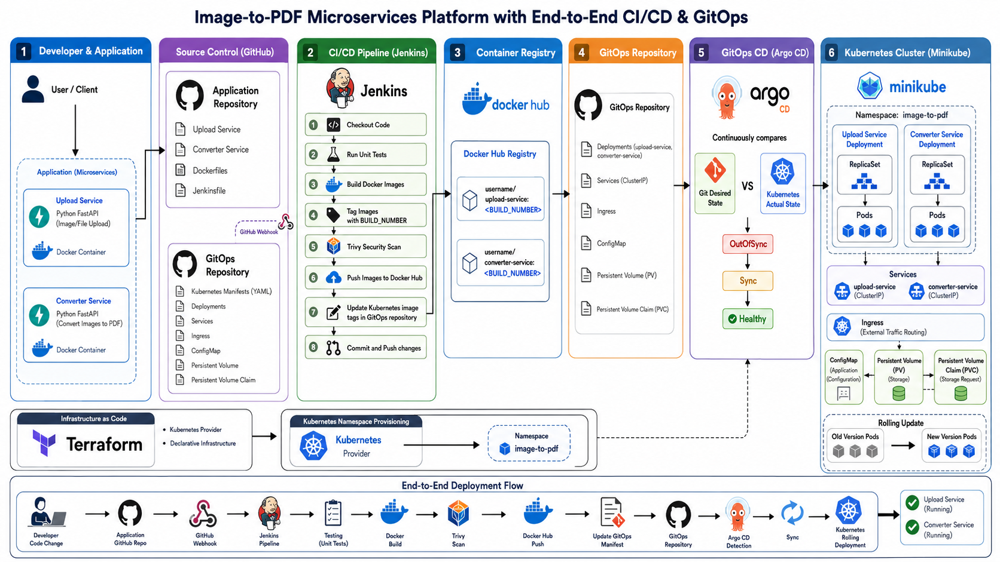
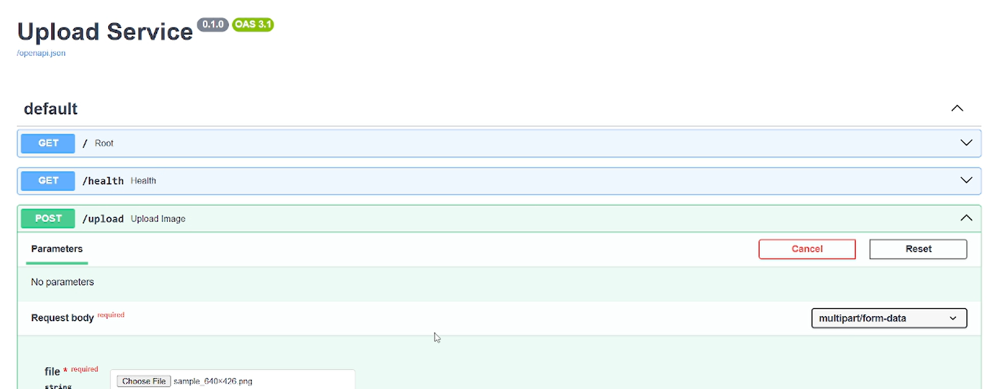
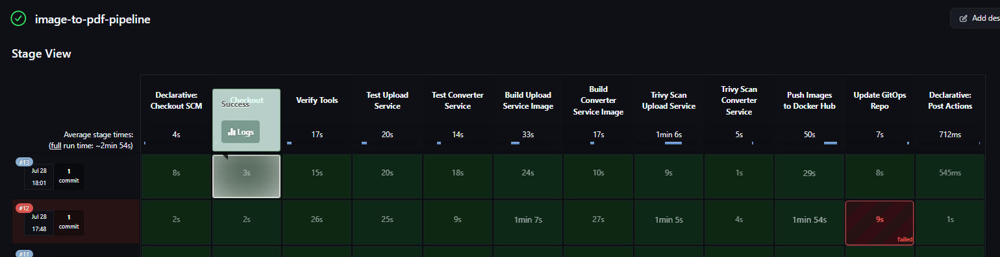
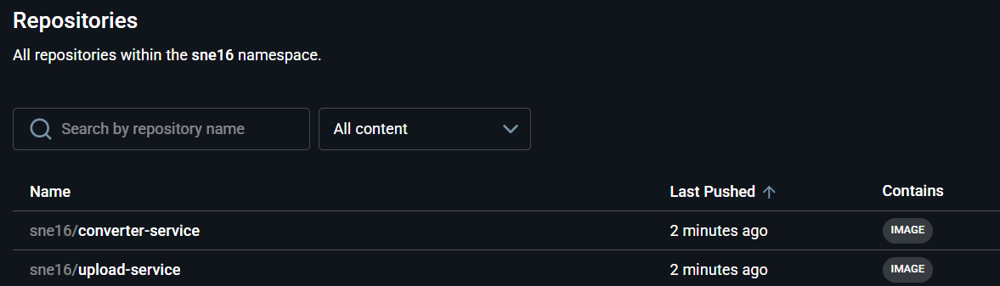
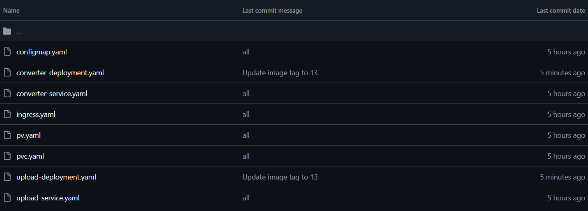
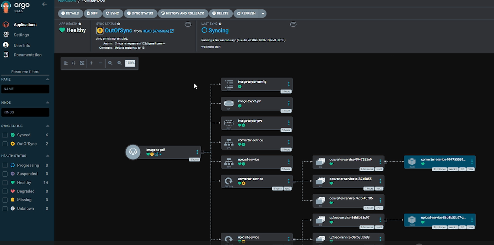
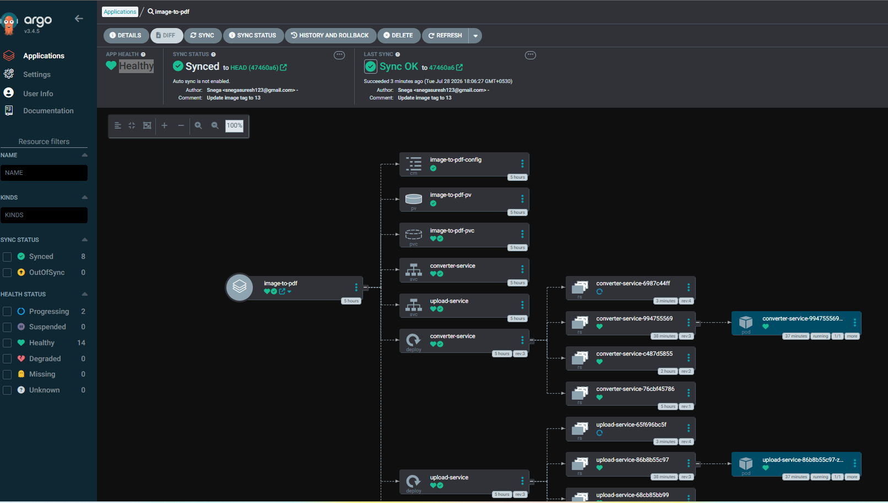
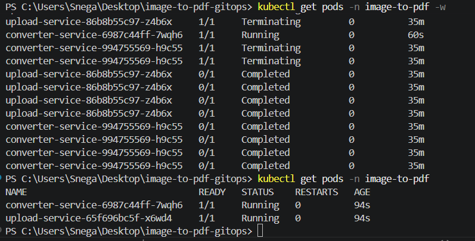
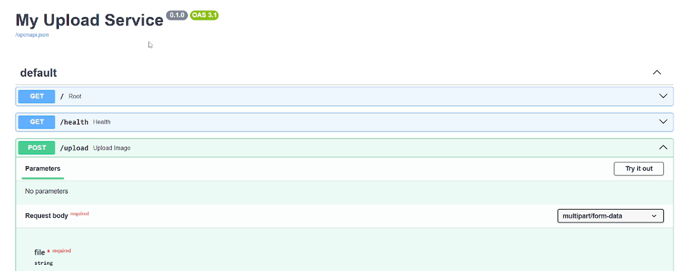

# 🚀 Image-to-PDF Microservices Platform with End-to-End CI/CD & GitOps

## 📌 Project Overview

This project demonstrates a production-style ** microservices application** with a complete **CI/CD and GitOps deployment workflow**.

The application is built using two independent microservices:

* **Upload Service** – Handles image/PDF upload requests.
* **Converter Service** – Processes uploaded files and performs conversion operations.

The entire software delivery lifecycle is automated using **Jenkins, Docker, Kubernetes, and Argo CD**, following modern DevOps practices such as containerization, infrastructure automation, continuous integration, continuous deployment, and GitOps-based release management.

---

# 🏗️ Architecture



---

# 🛠️ Tech Stack

## Application

* Python
* FastAPI
* REST APIs

## Containers

* Docker

## Container Orchestration

* Kubernetes
* Minikube
* Kubernetes Deployments
* Services
* Ingress
* ConfigMaps
* Persistent Volumes (PV)
* Persistent Volume Claims (PVC)
* Horizontal Pod Autoscaler (HPA)

## CI/CD & GitOps

* Jenkins
* GitHub
* GitHub Webhooks
* Argo CD
* Docker Hub

## Infrastructure as Code

* Terraform

## Monitoring & Security

* Trivy

---

# 🔄 CI/CD + GitOps Workflow

Application Before Update



## 1. Developer Push

A developer pushes application changes to the application repository.

Example:

```
Application Repository
|
├── upload-service
├── converter-service
├── Dockerfile
└── Jenkinsfile
```

The GitHub webhook automatically triggers the Jenkins pipeline.

---

# 2. Jenkins CI Pipeline

Jenkins performs the complete CI workflow:

### Automated Testing

* Installs dependencies.
* Creates Python environments.
* Executes unit tests.

### Docker Image Build

Each microservice is packaged into its own Docker image.

Example:

```
upload-service:12
upload-service:latest
converter-service:12
converter-service:latest
```

### Security Scanning

Trivy scans Docker images for vulnerabilities before publishing.

### Image Publishing

Validated images are pushed to Docker Hub.

---





# 3. GitOps Repository Update

The Kubernetes manifests are maintained separately from application code.

```
GitOps Repository

k8s/
|
├── upload-deployment.yaml
├── converter-deployment.yaml
├── service.yaml
├── ingress.yaml
├── pvc.yaml
└── configmap.yaml
```

After pushing new images, Jenkins automatically updates the Kubernetes deployment manifests with the latest image tag.

Example:

Before:

```yaml
image: sne16/upload-service:11
```

After:

```yaml
image: sne16/upload-service:12
```

The updated manifest is committed and pushed automatically.



---

# 4. Argo CD Continuous Deployment

Argo CD continuously monitors the GitOps repository.

When Git changes:

```
Git Desired State
        |
        |
        v
Argo CD detects difference
        |
        |
        v
OutOfSync
```



After synchronization:

```
Application Status:

SYNC STATUS: Synced
HEALTH STATUS: Healthy
```


Argo CD applies the changes automatically to Kubernetes.

---

# 5. Kubernetes Deployment

Kubernetes performs a rolling update.

Old version:

```
upload-service:v11
converter-service:v11
```

New version:

```
upload-service:v12
converter-service:v12
```



Kubernetes:

* Creates new pods.
* Terminates old pods.
* Maintains application availability.

Verification:

```bash
kubectl get pods
```

Output:

```
upload-service      Running
converter-service   Running
```



---

# ⭐ Key DevOps Concepts Demonstrated

✅ Microservices Architecture
✅ Docker Containerization
✅ Kubernetes Deployment Management
✅ CI/CD Automation
✅ GitOps Workflow
✅ Continuous Deployment
✅ Infrastructure as Code
✅ Automated Security Scanning
✅ Rolling Updates
✅ Declarative Infrastructure
✅ Configuration Drift Detection

---

# 🎯 Challenges Solved

During development, several real-world DevOps challenges were handled:

* Kubernetes deployment troubleshooting.
* Metrics Server configuration.
* Argo CD synchronization issues.
* Jenkins Git authentication.
* Automated GitOps manifest updates.
* Docker image version management.
* Kubernetes networking and Ingress configuration.
* CI/CD pipeline debugging.
